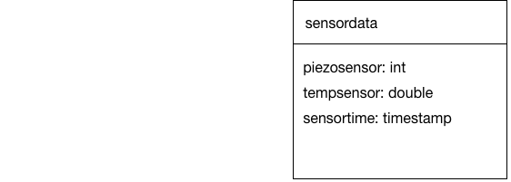

# Data Model

# SQL Code

## Create

    CREATE TABLE sensordata (
        piezosensor int,
        tempsensor double precision,
        sensortime timestamp DEFAULT current_timestamp
    );

## Insert

    INSERT INTO sensordata VALUES (112, 16, DEFAULT);